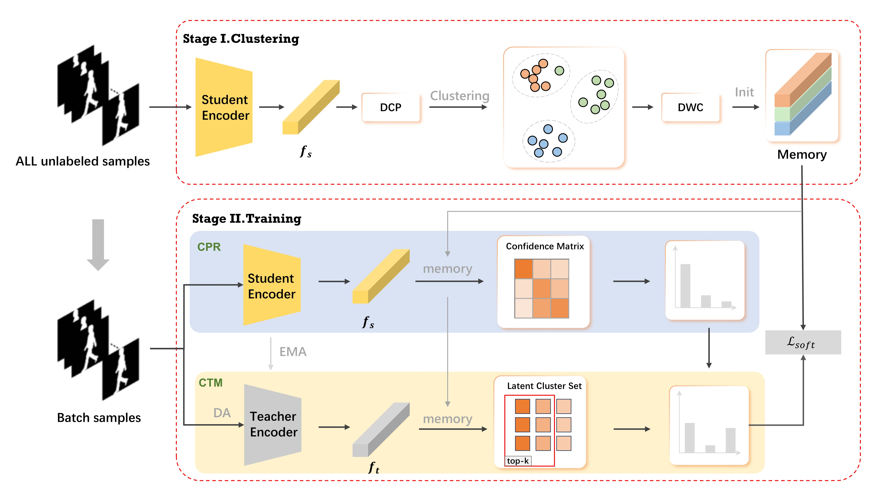

# Unsupervised Domain Adaptation with Dynamic Clustering and Contrastive Refinement for Gait Recognition


Introduction
---
we proposed a novel unsupervised domain adaptation model called GaitDCCR , which aims to reduce the influence of noisy pseudo labels on clustering stage and model training stage.



## Getting Started

---
### Clone this repo

```shell
git clone https://github.com/YanSun-github/GaitDCCR.git
```

### Install dependenices:
- pytorch >= 1.10
- torchvision
- pyyaml
- tensorboard
- opencv-python
- tqdm
- py7zr
- kornia
- einops

Install dependenices by Anaconda:
```shell
conda install tqdm pyyaml tensorboard opencv kornia einops -c conda-forge
conda install pytorch==1.10 torchvision -c pytorch
```
Or, Install dependenices by pip:
```shell
pip install tqdm pyyaml tensorboard opencv-python kornia einops
pip install torch==1.10 torchvision==0.11
```

## Prepare dataset 

---
Our model has been used in two mainstream datasets, CASIA-B and OUMVLP, to conduct unsupervised domain adaptation experiments. For dataset preparation, please refer to [opengait/prepare_dataset](https://github.com/ShiqiYu/OpenGait/blob/master/docs/2.prepare_dataset.md#prepare-dataset).

## Prepare checkpoint

---
In our method, Gaitset and GaitGL are used as backbone respectively. The [checkpoint](https://github.com/ShiqiYu/OpenGait/releases) of the feature extractor pre-trained on the labeled source dataset is directly used by the [opengait](https://github.com/ShiqiYu/OpenGait/) provided


## Train

---
Train a model by 
```shell
CUDA_VISIBLE_DEVICES=0 python -m torch.distributed.launch --nproc_per_node=1  gait_cluster_infomap.py --cfgs Path_to_yaml --phase train --checkpoint Path_to_checkpoint
```
- `python -m torch.distributed.launch` [DDP](https://pytorch.org/tutorials/intermediate/ddp_tutorial.html) launch instruction.
- `--nproc_per_node` The number of gpus to use, and it must equal the length of CUDA_VISIBLE_DEVICES.
- `--cfgs` The path to config file.
- `--phase` Specified as `train`.
- `--checkpoint` The path to pretrained checkpoint on target dataset.

Test
Evaluate the trained model by
```shell
CUDA_VISIBLE_DEVICES=0 python -m torch.distributed.launch --nproc_per_node=1  gait_cluster_infomap.py --cfgs Path_to_yaml --phase test --checkpoint  Path_to_checkpoint
```
- `--phase` Specified as `test`.
- `--checkpoint` The path to checkpoint.